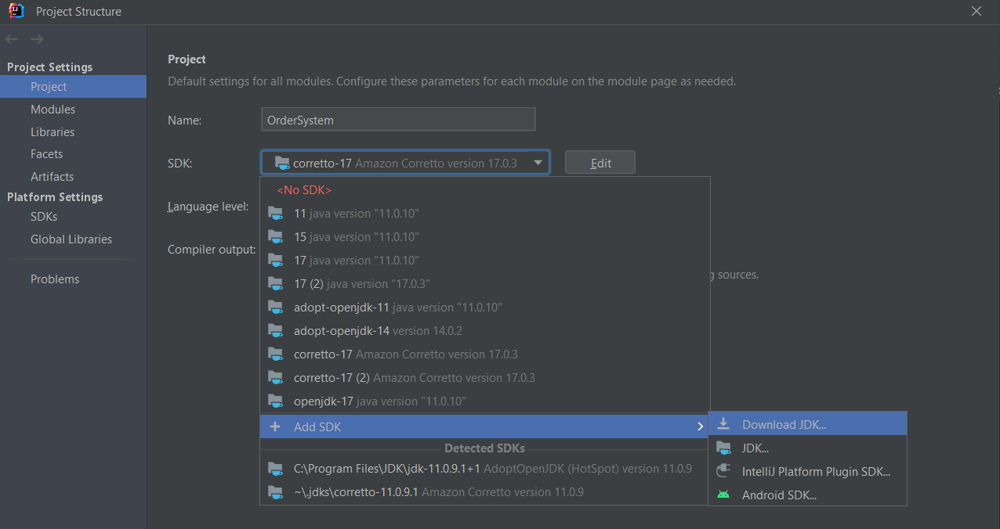
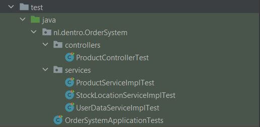
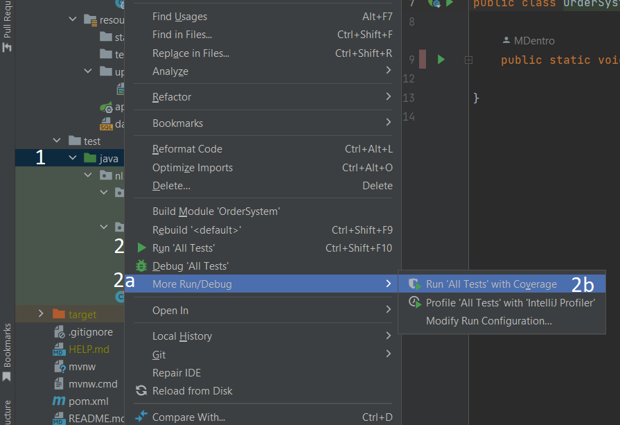
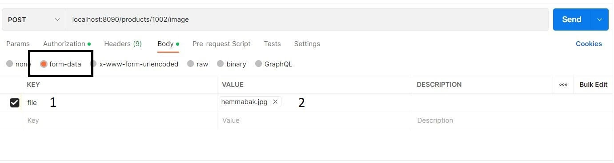

# Getting Started with the Springboot Order System application

## Table of content
* Introduction
* Necessities
* Installation Manual
    - Installing the needed applications
    - Installing the Order System application
    - Running the application
    - Running the tests
      - Without coverage
      - With coverage
* Endpoints
* Test users
* Roles


## Introduction
This application is build for a one man business with the possibility to have a different user role for a representative
(with limited access) in case of absence of the owner. The owner can create, read, update and delete products. 
The products can get assigned a stock locations. The representative can only read the orders and process a payment. 
Orders can be made containing user data and different products. The owner and representative can sign in so endpoints 
can be protected. 
Furthermore, images supporting the products can be uploaded and more.


## Necessities
* Code editor to run the application. IntelliJ IDEA is used during development
* Git repository link: https://github.com/MDentro/OrderSystem
* Internet connection
* Postman is used to test the endpoints
* Four Postman collections with all the JSON details to test the endpoints
    - _OrderSystem Authentication and authorisation
    - _OrderSystem Order
    - _OrderSystem Product and image
    - _OrderSystem Stocklocation
* Java version 17
* Maven
* Database


## Installation Manual

### Installing the needed applications

* IntelliJ IDEA:
  The code editor used during production can be downloaded here: https://www.jetbrains.com/idea/download/#section=windows

* Postman:
  The application which replaced the frontend can be downloaden here: https://identity.getpostman.com/signup

* Maven:
  Which is used as project management tool is already included in IntelliJ IDEA. When using another IDE you can download 
  it here: https://maven.apache.org/guides/getting-started/maven-in-five-minutes.html

* Java 17:
  If you don't have Java 17 installed it can be installed through IntelliJ IDEA. Please find a screenshot of IntelliJ IDEA below.




* PostgreSQL as database with pgAdmin is used during development, but you can also use a different relational database .


### Installing the Order System application
* Step 1: Download or clone the application from Git: https://github.com/MDentro/OrderSystem 
* Step 2: After opening the project Maven will install the necessary dependencies. If this doesn't work automatically 
please go to the pom.xml file and press the "M" icon in the right corner of the page.
* Step 3: PostgreSQL is used as a database. If you use a different database please install the right dependency by adding 
it to the pom.xml and press the "M" icon to install, als insert the correct replacements for all the following steps 
concerning PostgreSQL.
* Step 4: In order to connect the application to PostgreSQL please go to the application properties (can be found in the 
resources' folder) and change the username and password to your own credentials.
```yaml
    spring.datasource.username=YourUserNameHere
    spring.datasource.password=YourPasswordHere
```
* Step 5: Create a database in PostgreSQL through pgAdmin with the name "OrderSystem".
* Step 6: The application will run on localhost port 8090. Change this in the application properties (can be found at the top in the 
"resources" folder) if necessary.
* Step 7: Run the application.


### Running tests
There are two options for running the tests. Running with coverage or without.
Please search for the "test" folder in the folder structure and open this. In IntelliJ IDEA it looks like this:



#### Running tests without coverage
Please press with your right mouse button on the folder marked with the number 1 and then press with your left mouse button on the number 2

#### Running tests with coverage
Please press with your right mouse button on the folder marked with the number 1 and then hover on 2a and then move your mouse to 2b and press with your left mouse button.

In IntelliJ IDEA it looks like this:\



### Endpoints

| Endpoints description                                         | Request | URL                                                | Example value                          | Role           |
|---------------------------------------------------------------|---------|----------------------------------------------------|----------------------------------------|----------------|
| Create a new user                                             | POST    | http://localhost:8090/users                        | -                                      | ALL            |
| Sign in user                                                  | POST    | http://localhost:8090/auth                         | -                                      | ALL            |
|                                                               |         |                                                    |                                        |                |
| Display all products                                          | GET     | http://localhost:8090/products                     | -                                      | ALL            |
| Display all products by category                              | GET     | http://localhost:8090/products?category=value      | cooking (of type String category)      | ALL            |
| Display product by id                                         | GET     | http://localhost:8090/products/value               | 1001  (of type Long id)                | ALL            |
| Create new product                                            | POST    | http://localhost:8090/products                     | -                                      | ADMIN          |
| Update product by id                                          | PUT     | http://localhost:8090/products/value               | 1001 (of type Long id)                 | ADMIN          |
| Delete product by id (delete image if exists)                 | DELETE  | http://localhost:8090/products/value               | 1001 (of type Long id)                 | ADMIN          |
| Assign stock location to product                              | PUT     | http://localhost:8090/products/value/stocklocation | 1001 (of type Long id)                 | ADMIN          |
 | Upload image by assigning to product (delete image if exists) | POST    | http://localhost:8090/products/value/image         | 1001 (of type Long id)                 | ADMIN          |
|                                                               |         |                                                    |                                        |                |
| Download image by fileName                                    | GET     | http://localhost:8090/images/download/value        | aptitlig.jpg (of type String fileName) | ALL            |
|                                                               |         |                                                    |                                        |                |
| Create order                                                  | POST    | http://localhost:8090/orders                       | -                                      | ALL            |
| Display order by id                                           | GET     | http://localhost:8090/orders/value                 | 300 (of type Long id)                  | ADMIN and USER |
| Display unpaid orders                                         | GET     | http://localhost:8090/orders                       | -                                      | ADMIN and USER |
| Process payment                                               | PUT     | http://localhost:8090/orders/value                 | 300 (of type Long id)                  | ADMIN and USER |
|                                                               |         |                                                    |                                        |                |
| Create stock location                                         | POST    | http://localhost:8090/stocklocations               | -                                      | ADMIN          |
| Delete stock location                                         | DELETE  | http://localhost:8090/stocklocations/value         | 100 (of type Long id)                  | ADMIN          |
| Display available stock locations                             | GET     | http://localhost:8090/stocklocations               | -                                      | ADMIN          |


### Test users
| User name | Password      | Role  |
|-----------|---------------|-------|
| admin     | admin@Test1   | ADMIN |
| user      | user@Test1    | USER  |


### Roles
There are 3 roles in the application
- The "GUEST" user doesn't need a login. This user can only request the product data (all, by category and by id) with the image. 
This person can also send an order.
- The "USER" user needs a login. It is used by a representative in case of illness or holiday. This person can do 
the same things as a GUEST user and can also look at the orders and request a list with unpaid orders and process a payment.
- The "ADMIN" user needs a login and can do everything the USER can but can also create/update/delete products and stock 
locations and upload images.


### Examples
There is a postman collection to test the endpoints. Below you can find a complete overview of all the JSON formats that 
can be used to address the endpoints.

#### Authentication and authorisation
URL: http://localhost:8090/users \
Type: POST\
Role: ALL\
Description: Create a USER\
Additional Information: Your password should contain 6 tot 15 characters with at least one digit, one upper case letter, 
one lower case letter and one special symbol (“@#$%”) \
Body:
```yaml
{
    "userName": "user1",
    "password": "user@Test1",
    "roles": ["USER"]
}
```

URL: http://localhost:8090/users \
Type: POST\
Role: ALL\
Description: Create an ADMIN\
Additional Information: Your password should contain 6 tot 15 characters with at least one digit, one upper case letter, 
one lower case letter and one special symbol (“@#$%”) \
Body:
```yaml
{
    "userName": "admin1",
    "password": "admin@Test1",
    "roles": ["ADMIN"]
}
```

URL: http://localhost:8090/auth  \
Type: POST\
Role: ALL\
Description: Login as a USER\
Body:
```yaml
{
    "userName": "user",
    "password": "user@Test1"
}
```
URL: http://localhost:8090/auth  \
Type: POST\
Role: ALL\
Description: Login as an ADMIN\
Body:
```yaml
{
    "userName": "admin",
    "password": "admin@Test1"
}
```
#### Product

URL: http://localhost:8090/products  \
Type: GET\
Role: ALL\
Description: Get all products\
Body:
```yaml
{
    no body
}
```

URL: http://localhost:8090/products?category=cooking  \
Type: GET\
Role: ALL\
Description: Get all products by category\
Body:
```yaml
{
    no body
    only category in the url
}
```

URL: http://localhost:8090/products/1001  \
Type: GET\
Role: ALL\
Description: Get product by id\
Body:
```yaml
{
    no body
    only product id in the url
}
```

URL: http://localhost:8090/products  \
Type: POST \
Role: ADMIN\
Description: Create new product
Authorisation header: Bearer Token\
Body:
```yaml
{
    "name": "nameTest",
    "price": "2.99",
    "category": "cooking",
    "description": "desciptionTest"
}
```

URL: http://localhost:8090/products/1003 \
Type: PUT \
Role: ADMIN\
Description: Update product
Additional information: In order to update the image please reassign a new image by making use of the Assing image to
product endpoint\
Authorisation header: Bearer Token\
Body:
```yaml
{
  "name": "nameUpdateTest",
  "price": "10",
  "category": "cooking",
  "description": "descriptionUpdateTest"
}
```

URL: http://localhost:8090/products/1006  \
Type: DELETE \
Role: ADMIN\
Description: Delete product\
Additional information: Only products that have never been ordered can be deleted, due to administration reasons.\
Authorisation header: Bearer Token\
Body:
```yaml
    no body
    only product id in the url
```

URL: http://localhost:8090/products/1001/stocklocation \
Type: PUT \
Role: ADMIN\
Description: Assign stock location to product\
Additional information: When assigning a new stock location to a product the old stock location will be released 
and set available.\
Authorisation header: Bearer Token\
Body:
```yaml
  product id in url
```
```yaml
{
  "id": "106"
}
```

URL: http://localhost:8090/products/1002/image  \
Type: POST \
Role: ADMIN\
Description: Assign image to product
Additional information: When a product has an image assigned the new image will replace the old image and the old image 
will be deleted.\
Authorisation header: Bearer Token\
Body:
```yaml
  Select form data for the body - please note the black box in the image below
  Give the key the name "file" - please note the area marked with number "1"
  Select an image  - please note the area marked with number "2"
  product id in the url
```


#### Image
URL http://localhost:8090/images/download/aptitlig.jpg \
Type: GET \
Role: ALL\
Description: Get image by id\
Body:
```yaml
    no body
    product name in the url
```

#### Order
URL: http://localhost:8090/orders \
Type: POST\
Role: ALL\
Description: Create order\
Body:
```yaml
{
    "firstName": "firstNameTest",
    "lastName": "lastNameTest",
    "email": "testEmail@mail.com",
    "phoneNumber": "06-12345678",
    "productIds": [1001, 1002, 1003]
}
```

URL: http://localhost:8090/orders/1 \
Type: GET\
Role: ADMIN and USER\
Description: Get order by id\
Authorisation header: Bearer Token\
Body:
```yaml
    no body
    only order id in the url
```

URL: http://localhost:8090/orders \
Type: GET\
Role: ADMIN and USER\
Description: Get all unpaid orders\
Authorisation header: Bearer Token\
Body:
```yaml
    no body
```

URL: http://localhost:8090/orders/300 \
Type: PUT\
Role: ADMIN and USER\
Description: Process payment on an order\
Authorisation header: Bearer Token\
Body:
```yaml
    no body
    only order id in the url
```

#### Stock Locations
URL: http://localhost:8090/stocklocations \
Type: POST\
Role: ADMIN\
Description: Create a stock location\
Authorisation header: Bearer Token\
Body:
```yaml
{
    "location": "10.10.10"
}
```

URL: http://localhost:8090/stocklocations/1 \
Type: DELETE\
Role: ADMIN\
Description: Delete a stock location\
Authorisation header: Bearer Token\
Body:
```yaml
    no body
    only order id in the url
```

URL: http://localhost:8090/stocklocations \
Type: GET\
Role: ADMIN\
Description: Get all available stock location\
Authorisation header: Bearer Token\
Body:
```yaml
    no body
```